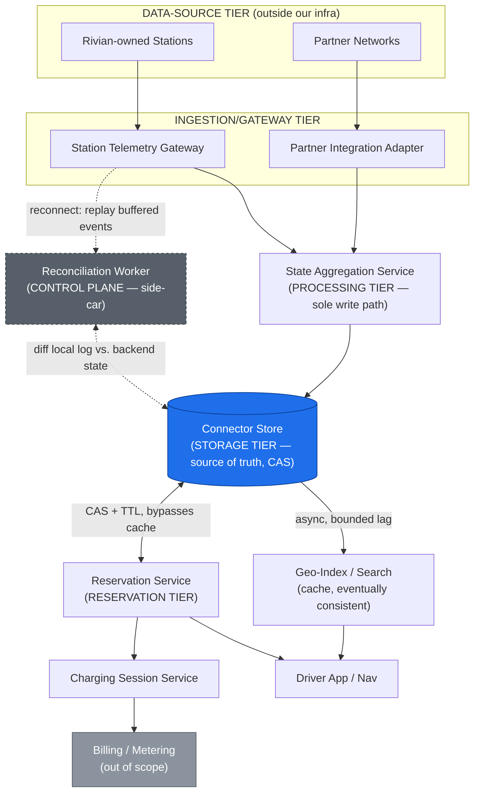
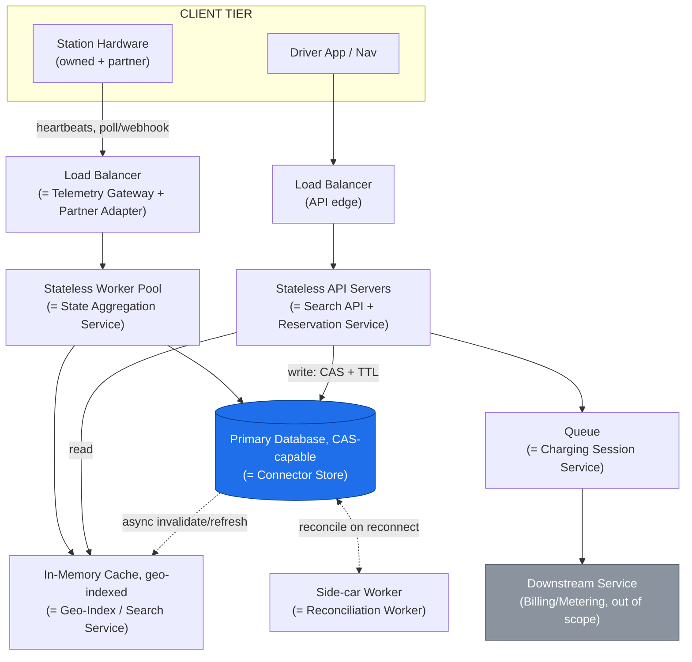

# System Design Mock Interview: Charging Station Availability / Reservation Network

**Company theme:** Rivian-style (vehicle/EV), also broadly applicable to Tesla, Electrify America, ChargePoint, or any EV charging network operator.
**Round:** System Design (45-60 min onsite loop)
**Interviewer expectation:** Structured problem-solving, not a specific tech stack. Clarify → requirements → estimate → high-level → deep dive → trade-offs → wrap-up.

This document is written as a self-contained interview walkthrough: it includes the clarifying questions you should ask, a model answer for each section, and the follow-up probes an interviewer is likely to throw at you.

---

## 0. Opening: Clarify the Problem (first 3-5 minutes)

Don't start designing immediately. Restate the prompt and ask clarifying questions to narrow scope. Sample dialogue:

> **You:** "Before I dive in — when you say 'charging station availability and reservation network,' are we designing Rivian's own proprietary charging network only, or do we also need to aggregate availability from third-party networks like Electrify America or ChargePoint?"
>
> **Interviewer:** "Both. Assume Rivian owns and operates some stations directly, but the majority of usable stalls for a Rivian driver come from partner networks we integrate with."
>
> **You:** "Got it. A few more questions:
> 1. Is 'availability' reported per-station or per-connector? A station usually has multiple stalls/connectors, each independently occupied or free.
> 2. Can a driver actually *reserve* a specific connector ahead of time, or just see a real-time 'likely available' signal and drive there?
> 3. What's the physical scale — how many stations and connectors are we designing for?
> 4. Do stations themselves have reliable connectivity, or should we assume they can also go offline (they're outdoor hardware on cellular/LTE modems, not always wired)?
> 5. Is dynamic/demand-based pricing in scope, or just availability and reservation?"

Assume the interviewer answers:
- Yes, real reservations with a hold — not just informational availability. A driver can reserve a specific connector for a short window (e.g., arriving within 30 minutes).
- Scale: ~50,000 stations (mix of owned + partner-aggregated), averaging 4 connectors each → ~200,000 connectors nationally, growing with network build-out.
- Stations absolutely can and do lose connectivity — they're physical roadside/parking-lot hardware on cellular backhaul, subject to the same intermittent-connectivity constraints as vehicles, sometimes worse (rural highway corridors, underground garages, power-cycling firmware).
- Dynamic pricing is out of scope for the core design — mention it as an extension at the end.
- Partner network integration should be treated as "best-effort, eventually consistent, and often lower-fidelity than our own stations" — assume partner APIs give slower-changing / more delayed availability data than Rivian-owned hardware, which reports over its own telemetry channel.

---

## 1. Functional Requirements

**Core function** — the 1-3 things this system must fundamentally do; everything else below is elaboration on how:

1. Maintain an accurate, near-real-time view of which connectors are actually available across owned and partner-operated stations.
2. Let a driver hold a specific connector for a bounded window without it being double-booked by another driver or a walk-up.
3. Keep the system usable when a station or region is offline, by degrading availability confidence rather than failing outright.

State the fuller requirement list explicitly on the whiteboard before designing anything.

1. **Connector-level real-time availability** — track and expose the state of every connector (AVAILABLE / OCCUPIED / RESERVED / FAULTED / OFFLINE-UNKNOWN) across both Rivian-owned and partner-network stations.
2. **Geo-search for nearby available (or likely-available) stations** — given a location, radius, and connector type/power level, return ranked candidate stations.
3. **Reservation with a short-lived hold/lease** — a driver reserves a specific connector for a bounded window (e.g., 15-30 min ETA); the connector must be prevented from being double-booked or claimed by a walk-up during that window.
4. **Physical arrival / plug-in confirmation** — when the driver plugs in, the reservation transitions to an active charging session; the hold is released back to the pool if the driver never shows up (TTL expiry).
5. **Conflict resolution on reconnect** — when a station or region regains connectivity after an outage, reconcile any local (station-side) state changes against the backend's view of reservations made during the gap.
6. **Partner network aggregation** — ingest availability feeds (push or poll) from third-party charging networks and normalize them into the same data model, clearly distinguishing "our own real-time telemetry" from "partner-reported, possibly stale" data.
7. **Graceful degradation for offline stations** — a station that can't be reached for a live confirmation should not simply be excluded from results; surface it as "likely available" (based on last-known state and time-decay confidence) rather than a hard block.
8. **Cancellation and no-show handling** — a driver can cancel a reservation; a reservation that isn't fulfilled within its TTL auto-expires and the connector returns to the general pool.
9. **Session-to-billing handoff** (boundary, not deep-dived) — once a charging session starts, session metering/billing is owned by a separate billing service; this system's job ends at "session started" / "session ended" events.

**Out of scope (state this explicitly):** the physical charger's power electronics and metering, payment processing, and dynamic/demand-based pricing algorithms — mention pricing as a natural extension in the wrap-up, but don't design it in depth unless asked.

---

## 2. Non-Functional Requirements

| Requirement | Target / Reasoning |
|---|---|
| **Consistency for reservations** | Strong consistency *within a region* for the reservation-hold operation on a single connector — two drivers must never both successfully hold the same connector. Across regions, eventual consistency is acceptable (a station in Texas doesn't need to know about a hold placed on a station in Oregon). |
| **Availability** | 99.9%+ for the read path (searching/browsing availability) — a stale or degraded read is far better than an outage, since drivers are often mid-route and need *some* answer. The write path (placing a reservation) can tolerate brief unavailability with a clear retry/error to the driver. |
| **Latency** | Geo-search + availability query: p99 under ~300ms (drivers are often on a car's built-in nav UI or a phone app, expecting map-like responsiveness). Reservation hold creation: p99 under ~500ms, since it involves a consistency-critical write. |
| **Staleness tolerance** | Real-time telemetry from owned stations: target under 30 seconds of staleness. Partner-network data: acceptable staleness up to a few minutes, clearly labeled with a "last updated" timestamp/confidence indicator to the driver. |
| **Partition tolerance** | Stations and even entire regions can lose connectivity for minutes to hours. The system must keep serving degraded ("likely available") answers rather than failing closed. |
| **Scalability** | Design for 50,000+ stations / ~200,000 connectors nationally, with geo-search query rates in the thousands per second at peak (road-trip season, EV road corridors). |
| **Correctness under race conditions** | The race between "reservation TTL expires" and "driver plugs in at that exact moment" must be handled deterministically and safely — never leave a connector in an ambiguous state. |
| **Auditability** | Every reservation, hold, expiry, and conflict-resolution decision should be logged for dispute resolution ("I was charged / blocked but I had a reservation"). |

Call out explicitly to the interviewer: *"This is fundamentally a distributed-locking-with-a-lease problem layered on top of a geo-indexed, eventually-consistent read path — and the twist versus a typical 'reserve a hotel room' system is that the thing being locked (a physical connector) is itself an unreliable, sometimes-offline actor in the system, not a passive database row."*

---

## 3. Back-of-the-Envelope Capacity Estimation

Doing this out loud shows quantitative rigor.

- **Network scale:** ~50,000 stations, ~4 connectors/station average → **~200,000 connectors** total (mix of Rivian-owned + partner-aggregated). Assume Rivian directly operates ~5,000 of those stations (~20,000 connectors); the rest are partner-network.
- **State update rate (owned stations):** each connector reports a heartbeat/state update roughly every 15-30 seconds (or on state change, whichever is more frequent) → `20,000 connectors × (1 update / 20s) ≈ 1,000 updates/sec` sustained from owned hardware alone — modest, but bursty around state-change events (e.g., a busy Supercharger-style corridor station at 5pm).
- **Partner feed ingestion:** assume partner APIs are polled or push updates every 60-120 seconds per station, aggregated across ~45,000 partner stations → roughly `45,000 / 90s ≈ 500 updates/sec` — lower fidelity but non-trivial volume.
- **Geo-search query rate:** assume 2M active app/nav users, with a modest fraction actively looking for a charge at any moment — peak estimate of ~2,000 geo-search queries/sec during peak travel windows (holidays, weekend road trips), versus a baseline of a few hundred/sec off-peak. This read traffic dominates the write traffic by roughly 2x, so the read path (geo-index) needs to be optimized independently of the write/state-update path.
- **Reservation rate:** far lower than search — assume ~5% of searches convert to an actual reservation hold → `2,000 × 0.05 = 100 reservation-holds/sec` at peak. This is the consistency-critical write path, and 100/sec is very manageable for a properly sharded key-value store with per-key (per-connector) locking.
- **Reservation hold duration:** TTL of ~15-30 minutes per hold; at 100 holds/sec average arrival and a 20-minute average TTL, the number of *concurrently active* holds in the system is roughly `100/sec × 1,200s ≈ 120,000` outstanding holds at any instant — this is the working-set size for the hot reservation-lease store, trivially small for an in-memory or SSD-backed KV store.
- **Geo-index size:** 200,000 connectors, each needing a lat/lon + a handful of attributes (connector type, power level, station id) — a few hundred bytes/connector → the entire geo-index is well under 1 GB, meaning it comfortably fits in memory on a small cluster, or even a single well-provisioned node, which strongly favors an in-memory geo-indexed cache in front of the durable store.

Conclusion to state out loud: *"The read (search) path dominates traffic and is latency-sensitive but tolerant of slight staleness, while the write (reservation) path is comparatively low-volume but consistency-critical. That asymmetry — high-volume/loose-consistency reads vs. low-volume/strict-consistency writes on a small working set — is the central insight that should drive the architecture: an in-memory geo-index for search, backed by a strongly consistent, per-connector-locked store for the reservation hot path."*

---

## 4. Data Model / Database Design

### Core entities

**`Station`** (a physical charging location, owned or partner)
```
station_id (PK)
network_owner        -- "rivian" | "electrify_america" | "chargepoint" | ...
name, address
latitude, longitude
connector_count
amenities             -- JSON: restrooms, food, covered parking, etc.
last_synced_at        -- for partner stations: when we last pulled/received data
data_source_tier      -- "realtime_telemetry" | "partner_polled" | "partner_pushed"
```

**`Connector`** (one physical plug/stall — the actual unit of contention)
```
connector_id (PK)
station_id (FK)
connector_type        -- "CCS", "NACS", "CHAdeMO", etc.
power_kw               -- max charging rate
state                  -- AVAILABLE / OCCUPIED / RESERVED / FAULTED / OFFLINE_UNKNOWN
state_confidence        -- "confirmed" | "inferred" (last-known + time-decay)
last_state_change_at
last_heartbeat_at
```
`state_confidence` is the key field that encodes graceful degradation: when a connector's `last_heartbeat_at` exceeds a freshness threshold, a background process doesn't delete or hard-block the connector — it flips `state_confidence` to `"inferred"` so downstream search/reservation logic can treat it as "likely available" with reduced ranking priority, rather than as a hard unknown.

**`ReservationHold`** (the short-TTL lease on a connector — this is the concurrency-control core of the system)
```
hold_id (PK)
connector_id (indexed, effectively unique-while-active)
driver_id
vehicle_id
created_at
expires_at             -- TTL, typically now() + 15-30 min
status                 -- PENDING / ACTIVE / FULFILLED / EXPIRED / CANCELLED
fulfillment_session_id -- set once plug-in is confirmed, links to ChargingSession
```
Enforce **at most one active (`PENDING`/`ACTIVE`) `ReservationHold` per `connector_id`** via a conditional write / compare-and-swap against the connector's current state — this is the exact mechanism that prevents double-booking. Store this table in a low-latency KV store with native TTL/expiry support (e.g., a Redis-like store or a database with native TTL indexes) so that expiry is enforced by the storage layer itself, not by a fragile polling job.

**`ChargingSession`** (an actual, physical charging event — created on plug-in confirmation)
```
session_id (PK)
connector_id
hold_id                -- nullable; null if this was a walk-up with no prior reservation
vehicle_id
started_at, ended_at
energy_delivered_kwh
```

**`StationStateEvent`** (append-only log of every state transition, for reconciliation and audit)
```
event_id (PK)
connector_id
from_state, to_state
source                 -- "station_telemetry" | "backend_reservation_logic" | "partner_feed" | "reconciliation"
timestamp
```

### Why split `Connector` (hot, mutable) from `StationStateEvent` (append-only)?

This mirrors a pattern worth narrating explicitly: *"`Connector` is the small, frequently-updated 'current state' table that both search and reservation logic read/write constantly — it needs to live in a fast KV or in-memory store partitioned for low-latency point access. `StationStateEvent` is an append-only history used almost exclusively for conflict-resolution-after-reconnect and audit/dispute investigation — a very different access pattern (time-range scans, replay) that belongs in a separate append-optimized or time-series store. Mixing them would force the hot path to carry the write-amplification cost of an ever-growing log."*

### Geo-indexing

`Connector`/`Station` location data is additionally maintained in a geospatial index (e.g., a geohash-bucketed structure or an R-tree/quadtree-backed index) kept largely in memory, refreshed incrementally as `Connector.state` changes — this is what makes "find available connectors within 5 miles, CCS, 150kW+" a sub-100ms query instead of a full table scan with a distance filter.

---

## 5. High-Level Design

This is an **infrastructure/topology view** — what pieces of infrastructure exist, what type each one is (load balancer, queue, cache, database, side-car worker...), and how they're wired together — not a step-by-step trace of one search-then-reserve journey. Sequencing and per-hop logic belong in the Deep Dives (§6); this section should stand on its own as "here's what we'd provision."

### Infrastructure tiers

**Client / data-source tier (outside our infrastructure, feeds and consumes the system)**
- **Driver App / Nav** — the read/write client for search and reservation.
- **Station hardware (owned + partner)** — Rivian-owned stations pushing heartbeats over a persistent connection, and third-party networks exposing poll/webhook APIs with lower fidelity.

**Ingestion/gateway tier (the boundary where physical stations and partner APIs meet our infrastructure)**
- **Station Telemetry Gateway** — a load-balanced, persistent-connection ingest edge for owned stations, tolerant of stations dropping and reconnecting. No business logic beyond auth and structural checks.
- **Partner Integration Adapter** — a pluggable, per-partner normalization layer (one adapter per third-party API), tagging incoming data with `data_source_tier` before it enters the shared model. Isolated per partner so one flaky API can't degrade the pipeline.

**Processing tier**
- **State Aggregation Service** — a stateless worker pool and the *only* write path into the source of truth; applies updates from both the gateway and the adapters, and runs staleness/`state_confidence` decay logic.

**Storage / serving tier (one source of truth, two different storage types for two different access patterns)**
- **Connector Store** — the strongly consistent primary database, supporting per-key conditional writes (CAS). This is the one piece of shared infrastructure both the search and reservation tiers below ultimately read from or write into.
- **Geo-Index / Search Service** — an in-memory, geo-partitioned cache, refreshed asynchronously (small, bounded lag) from the Connector Store — a deliberately eventually-consistent read replica, never on the reservation write path.

**Reservation tier (consistency-critical core, built directly on the source of truth)**
- **Reservation Service** — a stateless API layer owning the `ReservationHold` lifecycle via compare-and-swap plus storage-native TTL directly against the Connector Store, intentionally bypassing the geo-index cache entirely.

**Control-plane / side-car service (off the steady-state data path, activates only on reconnect)**
- **Reconciliation Worker** — diffs a station's replayed local event log against backend state after an outage; not part of the normal read/write flow, but load-bearing for correctness after a partition heals.

**Downstream / external tier**
- **Charging Session Service** — a queue-backed handoff opening/closing `ChargingSession` records on plug-in/unplug, feeding **Billing/Metering** (an external system, explicitly out of scope).

### Topology diagram (infrastructure view)

The two diagrams below show the same topology at two levels of abstraction: first by domain role, then by generic infra type (load balancer / queue / worker pool / cache / database) so it maps cleanly onto a standard "LB → server → cache → DB" mental model.





**Mapping cheat sheet (domain name → generic infra type):**

| Domain-named component | Generic infra type |
|---|---|
| Station Telemetry Gateway / Partner Integration Adapter | Load balancer + ingest-edge normalization |
| State Aggregation Service | Stateless worker pool |
| Connector Store | Strongly consistent primary database (CAS-capable) |
| Geo-Index / Search Service | In-memory cache, eventually consistent |
| Reservation Service + Search API | Stateless API server fleet — read path hits the cache, write path hits the DB directly |
| Reconciliation Worker | Side-car/control-plane worker, dormant except on reconnect |
| Charging Session Service | Queue/topic into a downstream (out-of-scope) service |

**Why this system doesn't fit the plain "LB → server → cache → DB" template cleanly:** most mock-interview systems (URL shortener, Twitter feed) have one dominant read/write pattern. This one deliberately has **two different consistency zones behind the same database** — a cache-backed eventually-consistent read path for search, and a direct, lock-based (CAS) write path for reservations that intentionally bypasses the cache. That split *is* the interesting part of the topology, so don't flatten it away just to match a generic template — but it's still built from the same primitives (LB, stateless servers, cache, queue, DB) you'd use anywhere else.

Narrate the key architectural decision: *"The one piece of shared infrastructure everything hangs off is the Connector Store — the strongly consistent source of truth. Search never touches it directly; it reads an eventually-consistent in-memory cache that trades a few hundred milliseconds of staleness for throughput. Reservations go the other way: they skip the cache entirely and hit the store's compare-and-swap path directly, because that's the one operation that can't tolerate staleness. The Reconciliation Worker is a side-car, not a tier in the steady-state path at all — it only wakes up when a partition heals. That's the whole topology: one consistent store, one eventually-consistent read replica of it, one direct write path that bypasses the replica, and one dormant control-plane worker for the reconnect case."*

---

## 6. Detailed Design / Deep Dives

Pick 2-3 of these based on interviewer interest — you won't have time for all of them in 45 minutes, so ask: *"Which of these would you like me to go deeper on: the reservation-hold/TTL mechanics, the plug-in race condition, geo-search, or partner-network conflict resolution?"*

### 6.1 Reservation hold with TTL, and preventing double-booking

- A reservation is created via a **conditional write**: `SET ReservationHold FOR connector_id WHERE no active hold exists AND connector.state == AVAILABLE`. This must be an atomic compare-and-swap at the storage layer (e.g., a Redis `SET NX` with an expiry, or a conditional-put in a database that supports compare-and-swap semantics) — two concurrent requests for the same connector must have exactly one winner.
- On success, `Connector.state` transitions to `RESERVED` and a `ReservationHold` row is written with `expires_at = now() + TTL`. The TTL is intentionally short (15-30 min) because it's blocking a scarce physical resource — unlike a hotel room, a charging connector's opportunity cost is measured in minutes, not days.
- **TTL enforcement lives in the storage layer**, not a cron job: using a store with native key-expiry (e.g., Redis `EXPIRE`, or a database with TTL-indexed collections) means an expired hold disappears and the connector reverts to `AVAILABLE` automatically, even if the Reservation Service itself is down — this avoids a single point of failure for "cleaning up" stale holds.
- A driver can *extend* a hold once (e.g., "running 10 minutes late") — modeled as updating `expires_at`, still gated by ownership check (only the holding `driver_id` can extend).

### 6.2 The plug-in vs. TTL-expiry race condition

This is the sharpest edge case in the whole system and worth walking through explicitly.

- **Scenario:** a driver's reservation is about to expire at T+30:00. They physically plug in at T+29:58 (just under the wire) or at T+30:02 (just after). The station sends a "plug-in detected" event to the backend at roughly the same moment the TTL-expiry logic fires.
- **Design principle:** *plug-in confirmation should win the race whenever it's ambiguous.* A driver who is physically at the connector, plugged in, should never be bumped because a timer fired a few seconds earlier — that's a terrible experience for a real-world scarce-resource system where "the car is already there" is the strongest possible signal of intent.
- **Mechanism:** implement this as a small grace window — when a plug-in event arrives for a connector whose hold expired within the last N seconds (e.g., 60s) and no other hold has since claimed it, honor the original driver's session rather than rejecting it. This requires *not* immediately deleting the expired hold record — instead, soft-expire it (mark `status = EXPIRED` but retain it, queryable for a short grace period) before it's fully reclaimed and made available to a different driver.
- If a *different* driver's hold has already claimed the connector by the time the original driver plugs in (i.e., the grace window has fully closed and someone else grabbed it), the original driver's plug-in should be rejected with a clear "your reservation expired and this connector is now held by someone else" message — the physical charger itself (via its firmware) is usually the final arbiter of who's allowed to actually draw power, so the backend's job is to keep that firmware's authorization list correct and to communicate clearly, not to physically prevent a plug from being inserted.

### 6.3 Reconciliation after connectivity is restored

- While a station is offline, it may still have local state changes: connectors freed up, faulted, or an offline driver plugged in manually without backend confirmation (many chargers allow "plug in and it just starts" as a fallback UX for exactly this scenario).
- The station buffers its own local `StationStateEvent`-equivalent log during the outage (store-and-forward, same principle as the OTA vehicle agent) and replays it to the backend on reconnect.
- The Reconciliation Worker merges the station's replayed local history against whatever the backend believes happened during the gap (e.g., a hold that was created against that connector while it was offline, based on stale "likely available" data). **Physical reality wins:** if the station reports a connector was actually occupied by a walk-up during the gap, any backend-side reservation hold that was speculatively made against it during the outage is invalidated, and the affected driver is notified and offered the nearest alternative (and, as a product/business decision, likely some form of goodwill credit — worth mentioning even though it's outside the technical design).
- Conflicts are resolved with a simple, explicit precedence rule stated to the interviewer: **station-reported physical state always takes precedence over backend-inferred state**, because the backend was, by definition, guessing during the outage.

### 6.4 Geo-search over availability, including degraded/offline stations

- The geo-index (geohash or quadtree-based) stores connector location + current `state` + `state_confidence`, and is queried with a bounding-radius + filter (connector type, minimum power, network owner) query pattern.
- Ranking blends distance with confidence and freshness: a slightly farther `confirmed AVAILABLE` connector may be ranked above a closer `inferred/likely-available` one, but the inferred one is still *returned*, just labeled and deprioritized — this directly implements the "degrade gracefully, don't hard-block" requirement.
- The index is updated asynchronously from the State Aggregation Service via a change stream, accepting a small (sub-second to low-seconds) propagation lag in exchange for keeping the hot search path fully decoupled from the write-heavy state-update path.

### 6.5 Partner network integration and data-quality tiers

- Each partner integration is isolated behind an adapter interface so a slow, flaky, or schema-changing partner API can't degrade the whole aggregation pipeline — apply circuit-breakers per partner, and if a partner feed goes stale beyond a threshold, mark all of that partner's connectors as `state_confidence = inferred` network-wide rather than silently serving arbitrarily old data as if it were fresh.
- Normalize partner connector-type/power vocabularies into Rivian's internal taxonomy at ingest time (e.g., mapping a dozen partner-specific connector type strings onto a canonical enum) so downstream search/reservation logic never has to special-case partner data.
- Reservation is generally **not** offered on partner connectors unless the partner's API explicitly supports a hold/reservation primitive — for partners that only expose availability (no reservation API), the product surfaces them as "navigate here, likely available" informational results only, an explicit and important scope boundary to call out.

---

## 7. Minimal API Surface (illustrative)

```
# Driver-facing
GET  /v1/stations/search?lat=&lon=&radius_km=&connector_type=&min_kw=
     → ranked list of stations/connectors with state, state_confidence, distance

POST /v1/reservations
     → { connector_id, driver_id, vehicle_id, eta_minutes }
     → creates a ReservationHold via conditional write; 409 if already held

DELETE /v1/reservations/{hold_id}          → cancel a hold

POST /v1/reservations/{hold_id}/extend     → extend TTL once, ownership-checked

# Station-facing (via Telemetry Gateway)
POST /v1/stations/{station_id}/connectors/{connector_id}/state
     → { state, timestamp }  (heartbeat / state-change push, idempotent)

POST /v1/stations/{station_id}/reconcile
     → replay of buffered local events after a reconnect

# Partner Integration Adapter (internal, one per partner)
GET  /internal/partners/{partner}/availability   → polled snapshot
POST /internal/partners/{partner}/webhook        → pushed update, if supported
```

---

## 8. Trade-offs and Alternatives Considered

| Decision | Chosen approach | Alternative | Why |
|---|---|---|---|
| Read path for search | Separate, eventually-consistent, in-memory geo-index | Query the strongly consistent connector store directly | Search traffic is ~10-20x reservation traffic; contending on the same store used for CAS-based holds would create latency spikes and lock contention exactly when the system is busiest. |
| Reservation locking | Per-connector compare-and-swap with storage-native TTL | Distributed lock service (e.g., a dedicated lock manager) with application-managed expiry | Native TTL on the hold record itself avoids a whole class of "forgot to release the lock" bugs and doesn't require the reservation service to stay up to clean up expired holds. |
| Plug-in vs. expiry race | Grace-window, physical-plug-in-wins-when-ambiguous | Strict TTL cutoff, no grace period | A strict cutoff is simpler but produces a genuinely bad user experience (being bumped seconds after arriving) for a low, bounded implementation cost. |
| Offline station handling | Degrade to "likely available" with confidence/decay labeling | Exclude offline stations from results entirely | Excluding entirely is simpler but actively unhelpful in exactly the scenario (rural/dead-zone charging) this system must handle well; a labeled, deprioritized result is strictly better for the driver. |
| Partner data | Normalize into common model, tag with data-quality tier, per-partner circuit breakers | Treat partner data identically to owned-station data | Partner feeds are lower-frequency and outside our operational control; conflating them with high-fidelity owned telemetry would silently degrade trust in "confirmed available" everywhere. |
| Conflict resolution after outage | Station-reported physical state always wins over backend-inferred state | Backend state (e.g., an active hold) always wins | The backend was guessing during the outage; the station's local log reflects what physically happened, which is ground truth. |

---

## 9. Failure Modes & Edge Cases to Call Out Proactively

- **Two drivers reserve the same connector within milliseconds of each other:** prevented by the atomic compare-and-swap on hold creation — exactly one request succeeds, the other gets a 409 and is offered the next-nearest alternative.
- **Driver reserves, then never shows up:** TTL expiry (enforced by the storage layer) returns the connector to the pool automatically; track no-show rate per driver as a potential future input to reservation eligibility/priority (mention as an extension, don't over-design).
- **Station goes offline mid-reservation (can't confirm plug-in in real time):** don't block the driver — if the station was last known `RESERVED` for this driver and goes offline, optimistically allow the plug-in attempt (the physical charger's own firmware/local authorization list is often the real gatekeeper) and reconcile the session record once connectivity returns.
- **A whole region loses connectivity simultaneously (e.g., a backhaul provider outage affecting many stations at once):** the system should distinguish "this specific connector is faulted" from "we lost telemetry from an entire region" — the latter should trigger an operational alert and a bulk `state_confidence = inferred` flip for the affected region, not silently return stale "available" data as ground truth.
- **Partner API returns inconsistent or clearly wrong data (e.g., reports 200 available connectors at a 4-stall station):** validate partner payloads against basic sanity bounds (connector count, plausible state transitions) and quarantine/flag a partner feed that fails validation rather than propagating garbage to drivers.
- **Clock skew between a station's local timestamp and the backend:** rely on backend-assigned timestamps for TTL/reconciliation ordering wherever possible, and treat station-reported timestamps as advisory rather than authoritative for conflict resolution.
- **Driver's app is offline and can't confirm cancellation:** an uncancelled-but-abandoned hold is already handled by the same TTL mechanism as a no-show — no special-casing needed, which is a nice emergent property of TTL-based holds.

---

## 10. Monitoring, Observability, and Security (brief)

- **Dashboards:** live map of connector states by region/network-owner, reservation conversion rate (search → hold → session), no-show rate, and per-partner feed staleness/error rate.
- **Alerting:** page on a spike in `OFFLINE_UNKNOWN` connectors within a region (signals a backhaul/regional outage rather than isolated hardware faults), and on abnormal reservation-conflict rates post-reconciliation (signals a bug in the CAS logic or a partner integration issue).
- **Security:** mutual-TLS or signed requests from station hardware to the Telemetry Gateway to prevent spoofed "available" state injection; rate-limiting and driver-identity checks on reservation creation to prevent abuse (e.g., a script mass-reserving connectors to deny service to other drivers — a real-world attack vector for scarce physical resources).
- **Auditability:** the append-only `StationStateEvent` log plus reservation lifecycle events support dispute resolution ("I had a reservation and was denied") and partner SLA verification (did the partner's reported availability match reality).

---

## 11. Wrap-up / How to Close the Interview

Summarize in 30 seconds: *"To recap: we split the system into a low-latency, eventually-consistent geo-indexed search path and a strongly consistent, TTL-leased reservation path on top of a shared connector-state store, with graceful degradation (labeled 'likely available' rather than hard exclusion) whenever a station can't be reached for live confirmation. We resolve the plug-in-vs-expiry race by letting physical arrival win within a grace window, and we resolve post-outage conflicts by treating station-reported physical state as ground truth over backend-inferred state. Partner networks are aggregated behind an adapter layer that isolates their lower fidelity from our own real-time telemetry."*

Then proactively offer a couple of extension directions, showing you know where the design could go next:
- How would you layer **dynamic, demand-based pricing** on top of this — e.g., surging price on high-demand connectors near a highway corridor during a holiday weekend, and how would that interact with the reservation system (does a held connector lock in a price)?
- How would you extend geo-search into **route-aware** recommendations (i.e., "available near my *route*," not just near my current point) — this is exactly the seam into the navigation-and-routing system.
- How would you handle a **fleet operator** (e.g., a rideshare/delivery company with many vehicles) wanting to reserve a block of connectors in advance for overnight charging — a fundamentally different, higher-volume reservation pattern than a single consumer driver.

---

## 12. Follow-up Questions Interviewers May Ask

- "Walk me through exactly what data structure and consistency mechanism you'd use to guarantee no two drivers can hold the same connector, at the storage layer, not just the application layer."
- "How would you handle a connector that a station reports as `FAULTED` but a driver's app claims they successfully plugged into and are charging — whose report do you trust?"
- "What happens if the Reservation Service itself is unavailable for a few minutes — does the whole charging network stop working, or can drivers still walk up and plug in?"
- "How would you design the grace-window logic for the plug-in-vs-expiry race so that it can't be abused (e.g., a driver claiming 'I plugged in in time' fraudulently after the fact)?"
- "How would your geo-index scale if the network grew 10x, to 500,000 stations globally, with very different connectivity characteristics per country?"
- "How do you decide how much to trust a partner network's reported availability versus your own telemetry, and how would you quantify/monitor that trust over time?"
- "If you had to add a 'reserve a connector for tomorrow morning' feature (far-future reservations, not just a 30-minute hold), what would change in the data model and consistency approach?"

---

## References

- Rivian system design round context: see [`../rivian/index.md`](../rivian/index.md), section "System Design Interview Questions."
- Shares its offline-first / eventually-consistent edge-device philosophy with [`ota-update-system-for-connected-vehicle-fleet.md`](./ota-update-system-for-connected-vehicle-fleet.md) — charging stations, like vehicles, are unreliable edge hardware, not always-on cloud clients.
